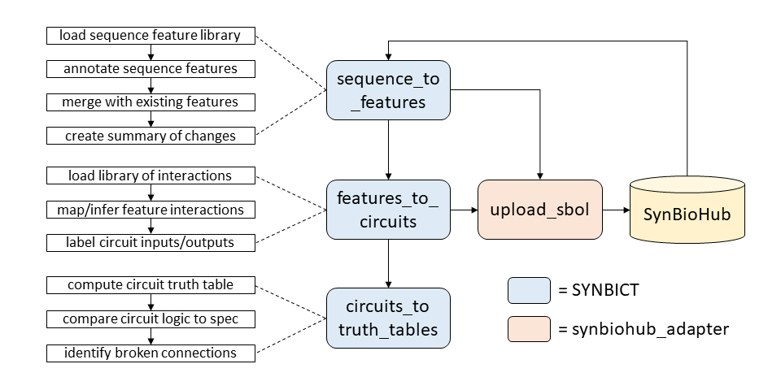

# SYNBICT
Synthetic Biology Curation Tools

## Installation instructions

This project depends on Python 3.

To install, run this command after changing directories to SYNBICT:

`python setup.py install`

If you want to visualize circuits, you need to install biopython, matplotlib and the fork of dnaplotlib at https://github.com/nroehner/dnaplotlib.

`pip install matplotlib`

## Testing

`python sequences_to_features.py -n http://synbict.org -t ../test/genetic_nand.xml -f ../test/cello_library.xml`

`python features_to_circuits.py -n http://synbict.org -i test_gate -t ../test/genetic_nand_annotated.xml -c ../test/cello_library.xml`

`python circuit_visualization.py -c ../test/genetic_nand_annotated_circuit.xml -f ../test/genetic_nand_annotated_circuit.xml`

## sequences\_to\_features.py

sequences_to_features.py annotates sequences in target SBOL, GenBank, or FASTA files and can be used to prune existing annotations on these sequences as well.

### Common arguments for sequences\_to\_features.py

Argument | Short Arg | Type | Description | Example
---- | --- | --- | --- | ---
`--namespace` | `-n` | `String` | **Required**. Namespace that you own or that you are reasonably certain is only used by you. | http://mynamespace.org
`--target_files` | `-t` | `String` | **Optional**. List of paths to input files or directories containing sequences to curate. Accepted file formats include SBOL XML, FASTA, and GenBank. If any paths to directories are provided, then all of their files of accepted formats are appended to the list. Default is an empty list. | targets1.xml targets2.fa target_directory
`--output_files` | `-o` | `String` | **Optional**. List of paths to output files. If its length is less than that of target_files, then the difference is populated with copies of the corresponding target file paths. If an output suffix is provided, then the copied target file paths are postfixed with this suffix. If no output suffix is provided, then the target files located by these paths will be overwritten. Alternatively, if output_files contains a single path to a directory, then the output list is formed by postfixing the target file names to this directory (with an output suffix if provided). | targets1_curated.xml targets2_curated.xml
`--output_suffix` | `-s` | `String` | **Optional**. Suffix for postfixing target file paths and names used to populate output_files. | curated
`--in_place` | `-p` | `Boolean` | **Optional**. If included, do not copy sequence objects prior to curation. Default is to curate copies of sequence objects. | -p
`--min_target_length` | `-m` | `Integer` | **Optional**. Minimum length that a sequence must be to curate (annotate and/or prune). Default is 2000 bp. | 2000
`--non_interactive` | `-ni` | `Boolean` | **Optional**. If included, do not ask user for additional input. Default is to ask user. | -ni
`--no_annotation` | `-na` | `Boolean` | **Optional**. If included, do not annotate sequences. Default is to annotate sequences. | -na
`--no_pruning` | `-np` | `Boolean` | **Optional**. If included, do not prune annotations on sequences. Default is to prune newly made annotations and previously existing annotations. | -np
`--log_file` | `-l` | `String` | **Optional**. Log file to populate with more verbose curation history. Default is to not generate a log file. | curation.log
`--validate` | `-v` | `Boolean` | **Optional**. If included, output files will be checked against SBOL validation rules. Default is to not validate output files. | -v

### Sequence annotation arguments for sequences\_to\_features.py

Argument | Short Arg | Type | Description | Example
---- | --- | --- | --- | ---
`--feature_files` | `-f` | `String` | **Optional**. List of paths to input files or directories containing features to create library for annotating sequences. Default is an empty list. Accepted file format is SBOL XML. | features1.xml feature_directory
`--min_feature_length` | `-M` | `Integer` | **Optional**. Minimum length that feature must be to include in library for annotating sequences. Default is 40 bp. | 40
`--extend_features` | `-e` | `Boolean` | **Optional**. If included, attempt to extend feature library. Derives new features from previously existing annotations in target file sequences only if their names align to the names of library features and if the fraction mismatch between their aligned sequences is less than the extension threshold. Default is to not extend feature library. | -e
`--extension_suffix` | `-xs` | `String` | **Optional**. Suffix for postfixing extended feature files. If not provided, then the original feature files will be overwritten. | extended
`--extension_threshold` | `-x` | `Float` | **Optional**. Maximum fraction mismatch between sequences permitted to extend feature library with new features based on previously existing annotations in target file sequences. | 0.05

### Annotation pruning arguments for sequences\_to\_features.py

Argument | Short Arg | Type | Description | Example
---- | --- | --- | --- | ---
`--cover_offset` | `-c` | `Integer` | **Optional**. Maximum distance between the start of one annotation and the start of another annotation (or the end of one annotation and the end of another annotation) to initiate pruning of overlapping annotations. Default is 14 bp. | 14
`--deletion_roles` | `-r` | `String` | **Optional**. List of URIs for Sequence Ontology roles. All annotated features with these roles will be removed from the target file sequences. Default is an empty list. | http://identifiers.org/so/SO:0000167 http://identifiers.org/so/SO:0000316
`--delete_flat` | `-d` | `Boolean` | **Optional**. If included, automatically delete annotations that do not refer to a sub-part. Default is no automatic deletion of these annotations. | -d
`--auto_swap` | `-a` | `Boolean` | **Optional**. If included, automatically merge any overlapping pair of a flat annotation and a sub-part annotation that do not overlap with any other annotations. Default is to ask user if merger should take place. | -a

## features\_to\_circuits.py

features_to_circuits.py infers genetic circuits from annotated sequences in target SBOL files (one per file) by comparing their annotated DNA sequence features to DNA features with documented interactions in one or more sub-circuit library files (also SBOL).

### Common arguments for features\_to\_circuits.py

Argument | Short Arg | Type | Description | Example
--- | --- | --- | --- | ---
`--namespace` | `-n` | `String` | **Required**. Namespace that you own or that you are reasonably certain is only used by you. | http://mynamespace.org
`--sub_circuit_files` | `-c` | `String` | **Required**. List of paths to input files or directories containing sub-circuits to create library for inferring composite circuits. | subcircuits1.xml subcircuits2.xml
`--no_build` | `-nb` | `Boolean` | **Optional**. If included, do not infer genetic circuits from annotated sequences in target files. Default is to infer genetic circuits. | -nb
`--log_file` | `-l` | `String` | **Optional**. Log file to populate with more verbose curation history. Default is to not generate a log file. | curation.log
`--validate` | `-v` | `Boolean` | **Optional**. If included, output files will be checked against SBOL validation rules. Default is to not validate output files. | -v

### Circuit inference arguments for features\_to\_circuits.py

Argument | Short Arg | Type | Description | Example
--- | --- | --- | --- | ---
`--target_files` | `-t` | `String` | **Optional**. List of paths to input files or directories containing annotated sequences from which to infer genetic circuits. Accepted file format is SBOL XML. If any path to a directory is provided, then all of their XML files are appended to the list. | targets1.xml target_directory
`--circuit_IDs` | `-i` | `String` | **Optional**. List of IDs given to the inferred genetic circuits (one per target file). By default uses the names of the corresponding target files (postfixed with circuit_suffix if provided). | targets1_circuit targets2_circuit
`--circuit_suffix` | `-s` | `String` | **Optional**. Suffix for postfixing IDs of inferred genetic circuits. | circuit
`--circuit_version` | `-cv` | `String` | **Optional**. Version given to inferred genetic circuits. Default is 1. | 1
`--output_files` | `-o` | `String` | **Optional**. List of paths to output files. If its length is less than that of target_files, then the difference is populated with copies of the corresponding target file paths. If an output suffix is provided, then the copied target file paths are postfixed with this suffix. If no output suffix is provided, then the target files located by these paths will be overwritten. Alternatively, if output_files contains a single path to a directory, then the output list is formed by postfixing the target file names to this directory (with an output suffix if provided). | mytargets_1_annotated_circuit.xml mytargets_2_annotated_circuit.xml
`--output_suffix` | `-os` | `String` | **Optional**. Suffix for postfixing target file paths and names used to populate output_files. | curated
`--input_identities` | `-ii` | `String` | **Optional**. List of URIs identifying known input species. These species are labeled as inputs in any inferred circuits. Default is an empty list. | 
`--output_identities` | `-oi` | `String` | **Optional**. List of URIs identifying known output species. These species are labeled as outputs in any inferred circuits. Default is an empty list. | 
`--min_target_length` | `-m` | `Integer` | **Optional**. Minimum length that an annotated sequence must be to consider its features when inferring a genetic circuit. Default is 2000 bp. | 2000
`--no_sensors` | `-ns` | `Boolean` | **Optional**. If included, do not add library sub-circuits for non-covalent interactions between small molecules and proteins to the inferred composite circuit. Default is to add these sub-circuits and attempt to abstract them by deriving stimulation and inhibition interactions from them in the composite circuit. | -ns
`--tx_threshold` | `-d` | `Integer` | **Optional**. Maximum distance between an annotated promoter feature and an annotated CDS feature that is permitted to infer an interaction between them (an interaction not present in the sub-circuit library). Default is 200 bp. | 200

### Sub-circuit library extension arguments for features\_to\_circuits.py

Argument | Short Arg | Type | Description | Example
--- | --- | --- | --- | ---
`--extend_sub_circuits` | `-e` | `Boolean` | **Optional**. If included, attempt to extend the sub-circuit library. Derives new sub-circuits from DNA features in the sub-circuit files only if their names align to the names of other DNA features in the sub-circuit library and if the fraction mismatch between their aligned sequences is less than the extension threshold. Default is to not extend the sub-circuit library. | -e
`--extension_suffix` | `-xs` | `String` | **Optional**. Suffix for postfixing extended sub-circuit files. If not provided, then the original sub-circuit files will be overwritten. | circuit
`--extension_threshold` | `-x` | `Float` | **Optional**. Maximum fraction mismatch between sequences permitted to extend the sub-circuit library. New dub-circuits are derived from DNA features in the sub-circuit files that are not part of an existing sub-circuit but are similar to a DNA feature that is part of such a sub-circuit. | 0.05

-i circuit name (required)
-c parts collection (required)

-n http://foo.bar -i bob 
-t ~/tmp/cpc/Cello_Parts_collection/Strain_3_MG1655_Genomic_IcaR_Gate_annotated.xml 
-c ~/tmp/cpc/Cello_Parts_collection/Cello_Parts_collection.xml 

## circuit_visualization.py

### Arguments
 -c file to visualize, which must have at least one ModuleDefinition
   -h, --help            show this help message and exit
  -c CIRCUIT_FILE, --circuit_file CIRCUIT_FILE
  -f [FEATURE_FILES [FEATURE_FILES ...]], --feature_files [FEATURE_FILES [FEATURE_FILES ...]]
  -l [CURATION_LOG], --curation_log [CURATION_LOG]
  -m [MIN_FEATURES], --min_features [MIN_FEATURES]
  -v, --validate
