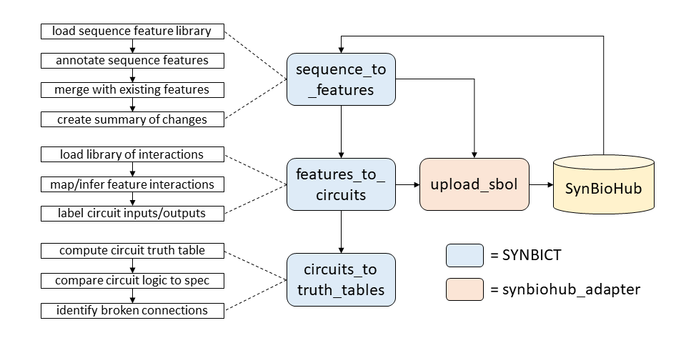

# SYNBICT 2.0
Synthetic Biology Curation Tools



## Installation instructions

This project depends on Python 3.

### Quick install

**Minimum install** (covers `-flashText`, `-bwa`, `-minimap2`, and `-blastn` modes):

```bash
# 1. Clone the repo
git clone https://github.com/SD2E/SYNBICT.git
cd SYNBICT

# 2. Create the conda env (Python 3.11 + minimap2, bwa, blast, emboss, and Python deps)
conda env create -f environment.yml
conda activate synbict_conda

# 3. Install SYNBICT in editable mode
pip install -e .
```

**Add Prokka** (only if you need `-prokka` protein annotation). SYNBICT expects Prokka 1.14.6 extracted at `./prokka-1.14.6/` (hardcoded in [sequences_to_features/ProkkaAligner.py:8](sequences_to_features/ProkkaAligner.py#L8)). From the SYNBICT root with `synbict_conda` active:

```bash
# 4. Download and extract the Prokka 1.14.6 release tarball
wget https://github.com/tseemann/prokka/archive/refs/tags/v1.14.6.tar.gz
tar -xzf v1.14.6.tar.gz   # creates ./prokka-1.14.6/

# 5. Put Prokka on PATH (persists to ~/.bashrc)
export PROKKA_HOME="$PWD/prokka-1.14.6"
export PATH="$PATH:$PROKKA_HOME/bin"
echo "export PROKKA_HOME=\"$PWD/prokka-1.14.6\"" >> ~/.bashrc
echo 'export PATH="$PATH:$PROKKA_HOME/bin"' >> ~/.bashrc
source ~/.bashrc

# 6. Install Prokka's runtime deps into synbict_conda
conda install -c conda-forge -c bioconda \
    openjdk perl-bioperl perl-datetime perl-xml-simple perl-digest-md5 "gsl=2.5.*"

# 7. Build the Prokka BLAST database
prokka --setupdb
```

**Verify**

```bash
conda compare environment.yml          # active env matches the spec file
python -m sequences_to_features --help
prokka --version                       # only if you installed Prokka
```

The sections below explain each step in more detail.

### Create the conda environment (recommended)

The repo ships with [`environment.yml`](environment.yml), which provisions Python and the external tools SYNBICT shells out to (`minimap2`, `bwa`, `blast`, `emboss`) along with required Python packages. From the SYNBICT root:

```bash
conda env create -f environment.yml
conda activate synbict_conda
```

After activating the env, install SYNBICT itself in editable mode:

```bash
pip install -e .
```

To update the env later after editing `environment.yml`:

```bash
conda env update -f environment.yml --prune
```

To verify your active env matches the spec file:

```bash
conda compare environment.yml
```

Prokka is optional and not included in `environment.yml`. If you need protein-level annotation (`-prokka` mode), follow the steps in the next section.

### Install Prokka (optional, for `-prokka` mode)

Prokka enables protein-level annotation. Skip this section if you don't need `-prokka`. The steps below assume the `synbict_conda` env is active and you are in the SYNBICT root directory.

SYNBICT expects Prokka **1.14.6** specifically — [sequences_to_features/ProkkaAligner.py:8](sequences_to_features/ProkkaAligner.py#L8) hardcodes `PROKKA_BIN = "./prokka-1.14.6/bin/prokka"`. Use the release tarball, not `git clone` (which would produce a `prokka/` directory the code can't find).

**1. Download and extract the Prokka 1.14.6 release tarball**

```bash
wget https://github.com/tseemann/prokka/archive/refs/tags/v1.14.6.tar.gz
tar -xzf v1.14.6.tar.gz   # creates ./prokka-1.14.6/
```

**2. Add Prokka to PATH**

```bash
export PROKKA_HOME="$PWD/prokka-1.14.6"
export PATH="$PATH:$PROKKA_HOME/bin"

echo "export PROKKA_HOME=\"$PWD/prokka-1.14.6\"" >> ~/.bashrc
echo 'export PATH="$PATH:$PROKKA_HOME/bin"' >> ~/.bashrc
source ~/.bashrc
```

**3. Install Prokka's runtime dependencies into `synbict_conda`**

```bash
conda install -c conda-forge -c bioconda \
    openjdk \
    perl-bioperl \
    perl-datetime \
    perl-xml-simple \
    perl-digest-md5 \
    "gsl=2.5.*"
```

The versions confirmed working in `synbict_conda` are `gsl=2.5`, `perl-bioperl=1.6.924`, and `perl-xml-simple=2.22`.

**4. Build the Prokka BLAST database**

```bash
prokka --setupdb
```

Prokka now works with `-prokka` mode in `sequences_to_features.py`. See the [Protein Annotation (Prokka)](#protein-annotation-prokka) section below for usage.

### Manual installation (alternative)

To install without conda, run the command below after changing directories to SYNBICT. Note that you may need to clone pySBOL2 from GitHub (https://github.com/SynBioDex/pySBOL2) and install it manually since SYNBICT requires pySBOL2 version 1.3 and at time of writing there is no public release available for this version yet.

```bash
pip install .
```

If you want to visualize circuits, you need to install matplotlib and the fork of dnaplotlib at https://github.com/nroehner/dnaplotlib.

`pip install matplotlib`

## sequences_to_features

Annotates sequences in SBOL, GenBank, or FASTA target files using a feature library. Supports FlashText (exact string matching), BWA, Minimap2, BLASTN, and Prokka (protein-level) annotation methods.

---

### External tool requirements

Only needed for the corresponding alignment method:

| Tool | Required for |
|------|-------------|
| `bwa` | `-bwa` mode |
| `minimap2` | `-minimap2` mode |
| `blastn` | `-blastn` mode |
| `prokka` | `-prokka` mode |

---

### Running from the SYNBICT root directory

All commands below should be run from the SYNBICT root:

```bash
cd /path/to/SYNBICT
```

The tool is invoked as a Python module:

```bash
python -m sequences_to_features [arguments]
```

---

### Workflow

#### Step 1 — Build the alignment index (required for BWA / Minimap2 / BLASTN)

This pre-computes indexes for BWA, BLASTN, and Minimap2 from your feature library. Only needed once per library.

```bash
python -m sequences_to_features \
    -n http://mynamespace.org \
    -f example/jet_libs/CIDAR_MoClo_*.xml \
    -bi
```

This writes `test.fasta` and index files (`test.*`) to the current directory.

> **FlashText** does not require a pre-built index and can be used without `-bi`.

---

#### Step 2 — Annotate a target file

##### FlashText (exact string matching — no index required)

```bash
python -m sequences_to_features \
    -n http://mynamespace.org \
    -f example/jet_libs/CIDAR_MoClo_*.xml \
    -t 11508_addgene_out.xml \
    -flashText -np -o 11508_out.xml
```

##### BWA — similar match

```bash
python -m sequences_to_features \
    -n http://mynamespace.org \
    -f example/jet_libs/CIDAR_MoClo_*.xml \
    -t 11508_addgene_out.xml \
    -bwa -np -o 11508_out.xml
```

##### BWA — exact match (100% identity)

```bash
python -m sequences_to_features \
    -n http://mynamespace.org \
    -f example/jet_libs/CIDAR_MoClo_*.xml \
    -t 11508_addgene_out.xml \
    -bwa -exact -np -o 11508_out_exact.xml
```

##### Minimap2 — similar match

```bash
python -m sequences_to_features \
    -n http://mynamespace.org \
    -f example/jet_libs/CIDAR_MoClo_*.xml \
    -t 11508_addgene_out.xml \
    -minimap2 -np -o 11508_out.xml
```

##### BLASTN — similar match

```bash
python -m sequences_to_features \
    -n http://mynamespace.org \
    -f example/jet_libs/CIDAR_MoClo_*.xml \
    -t 11508_addgene_out.xml \
    -blastn -np -o 11508_out.xml
```

##### Circular plasmid — annotate features that span the origin

Add `-cir` to any of the BWA / Minimap2 / BLASTN commands when the target is a
circular plasmid. SYNBICT extends the query past the origin before alignment, so
a feature that wraps from the end of the sequence back to the start is detected
and written as a single annotation with two `Range` locations. The annotated
target is also typed `SO_CIRCULAR`. A target already typed `SO_CIRCULAR` in the
input is treated as circular automatically, even without `-cir`.

```bash
python -m sequences_to_features \
    -n http://mynamespace.org \
    -f example/jet_libs/CIDAR_MoClo_*.xml \
    -t 11508_addgene_out.xml \
    -blastn -cir -np -o 11508_out.xml
```

##### Short-feature matching (9-13 bp) — on by default

Seed-based aligners cannot report matches shorter than ~14 bp against a
plasmid-length query. For every non-FlashText method (BWA, Minimap2, BLASTN),
SYNBICT complements alignment with an exhaustive exact substring search (forward
and reverse complement) over library features of 9-13 bp, merged into the same
annotation pass so the two methods jointly cover the full part-length range. This
runs automatically; pass `-nsf` / `--no_short_feature_matching` to turn it off.

```bash
python -m sequences_to_features \
    -n http://mynamespace.org \
    -f example/jet_libs/CIDAR_MoClo_*.xml \
    -t 11508_addgene_out.xml \
    -blastn -nsf -np -o 11508_out.xml     # short-feature pass disabled
```

##### Non-maximum suppression (NMS) — collapse overlaps to one part per locus

By default SYNBICT reports every matching part, including a shorter part nested
within a longer one, and including several different library parts that all match
the same locus. Pass `-nms` / `--nms` to collapse overlapping hits to the single
highest-scoring part at each locus: a hit that overlaps a higher-scoring one by
>=50% is dropped, while non-overlapping and equal-scoring parts are kept.

Hits are ranked by bitscore on the BLASTN path, and by number of identical bases
(or reference length, for exact matching) on the BWA and Minimap2 paths. NMS is
off by default and applies to **BWA, Minimap2 and BLASTN**. Enable it when you
need a clean, one-part-per-locus annotation, e.g. for downstream circuit
reconstruction; leave it off for exhaustive annotation.

```bash
python -m sequences_to_features \
    -n http://mynamespace.org \
    -f example/jet_libs/CIDAR_MoClo_*.xml \
    -t 11508_addgene_out.xml \
    -blastn -nms -np -o 11508_out.xml
```

##### DNA identity threshold — how close a match has to be

`-pid` / `--pid_threshold` sets the minimum **coverage-weighted** DNA identity a
hit must reach to be kept, as a percentage. Coverage-weighted means
identical bases divided by the *reference* (library part) length, not by the
alignment length -- so a hit that matches perfectly over only half the part
scores ~50%, not 100%. This keeps partial hits from passing as full-length parts.

The default is `95`. Lower it to recover diverged or partially covered parts;
raise it toward 100 to keep only near-exact matches. The threshold applies to
**BWA, Minimap2 and BLASTN**, and **only for similar (non-exact) matching** --
with `-exact` a hit must be 100% identical over the full reference length, so the
threshold is not consulted.

```bash
python -m sequences_to_features \
    -n http://mynamespace.org \
    -f example/jet_libs/CIDAR_MoClo_*.xml \
    -t 11508_addgene_out.xml \
    -blastn -pid 95 -np -o 11508_out.xml     # keep only hits at >=95% identity
```

---

### Protein Annotation (Prokka)

Prokka runs alongside any of the DNA alignment tools (BWA, Minimap2, BLASTN, or FlashText) to add protein-level matches. It requires `prokka` on PATH and a `database_protein.fasta` file in the working directory.

##### BWA + Prokka

```bash
python -m sequences_to_features \
    -n http://mynamespace.org \
    -f example/jet_libs/CIDAR_MoClo_*.xml \
    -t 11508_addgene_out.xml \
    -bwa -prokka -np -o 11508_out_protein.xml
```

##### Prokka mode

`-prokka_mode` controls which protein matches are kept (default: `exact`):

| Mode | Behavior |
|------|----------|
| `exact` | Keep only 100% protein identity matches |
| `similar` | Keep any identity, exclude hypothetical proteins |
| `all` | Keep all matches regardless of identity or product name |

```bash
# Example: BLASTN + Prokka with similar matches
python -m sequences_to_features \
    -n http://mynamespace.org \
    -f example/jet_libs/CIDAR_MoClo_*.xml \
    -t 11508_addgene_out.xml \
    -blastn -prokka -prokka_mode similar -np -o 11508_out_protein.xml
```

---

### sequences\_to\_features.py

sequences_to_features.py annotates sequences in target SBOL, GenBank, or FASTA files and can be used to prune existing annotations on these sequences as well.

#### Common arguments for sequences\_to\_features.py

Argument | Short Arg | Type | Description | Example
---- | --- | --- | --- | ---
`--namespace` | `-n` | `String` | **Required**. Namespace that you own or that you are reasonably certain is only used by you. | http://mynamespace.org
`--target_files` | `-t` | `String` | **Optional**. List of paths to input files or directories containing components to curate. Accepted file formats include SBOL XML, FASTA, and GenBank. If any paths to directories are provided, then all of their files of accepted formats are appended to the list. Default is an empty list. | targets1.xml targets2.fa target_directory
`--output_files` | `-o` | `String` | **Optional**. List of paths to output files. If its length is less than that of target_files, then the difference is populated with copies of the corresponding target file paths. If an output suffix is provided, then the copied target file paths are postfixed with this suffix. If no output suffix is provided, then the target files located by these paths will be overwritten. Alternatively, if output_files contains a single path to a directory, then the output list is formed by postfixing the target file names to this directory (with an output suffix if provided). | targets1_curated.xml targets2_curated.xml
`--output_suffix` | `-s` | `String` | **Optional**. Suffix for postfixing target file paths and names used to populate output_files. | curated
`--in_place` | `-p` | `Boolean` | **Optional**. If included, do not copy components prior to curation. Default is to curate copies of components. | -p
`--min_target_length` | `-m` | `Integer` | **Optional**. Minimum length that component must be to curate (annotate and/or prune). Default is 2000 bp. | 2000
`--minimal_output` | `-mo` | `Boolean` | **Optional**. If included, only output annotated components and none of their sub-components or sequences. | -mo
`--non_interactive` | `-ni` | `Boolean` | **Optional**. If included, do not ask user for additional input. Default is to ask user. | -ni
`--log_file` | `-l` | `String` | **Optional**. Log file to populate with more verbose curation history. Default is to not generate a log file. | curation.log
`--validate` | `-v` | `Boolean` | **Optional**. If included, output files will be checked against SBOL validation rules. Default is to not validate output files. | -v
`--sbh_URL` | `-U` | `String` | **Optional**. If included, SYNBICT will attempt to log into the specified SynBioHub instance | https://synbiohub.org
`--username` | `-u` | `String` | **Optional**. If included, SYNBICT will use as the username to log into the specified SynBioHub instance. | igemer217
`--password` | `-w` | `String` | **Optional**. If included, SYNBICT will use as the password to log into the specified SynBioHub instance. | w3j4d!d5adg6
`--target_URLs` | `-T` | `String` | **Optional**. List of URLs for SBOL objects. If included, SYNBICT will download these objects from the specified SynBioHub instance and curate them. Can be used in combination with the target_files argument. | https://synbiohub.org/public/igem/BBa_K731020/1 https://synbiohub.org/public/iGEMDistributions/iGEM2019Distribution_collection/1

#### Annotation arguments for sequences\_to\_features.py

Argument | Short Arg | Type | Description | Example
---- | --- | --- | --- | ---
`--feature_files` | `-f` | `String` | **Optional**. List of paths to input files or directories containing features to create library for annotating components. Default is an empty list. Accepted file format is SBOL XML. | features1.xml feature_directory
`--feature_URLs` | `-F` | `String` | **Optional**. List of URLs for SBOL objects. If included, SYNBICT will download these objects from the specified SynBioHub instance and use them to create a library for annotating components. Can be used in combination with the feature_files argument. | https://synbiohub.programmingbiology.org/public/Cello_Parts/Cello_Parts_collection/1
`--min_feature_length` | `-M` | `Integer` | **Optional**. Minimum length that feature must be to include in library for annotating components. Default is 40 bp. | 40
`--no_annotation` | `-na` | `Boolean` | **Optional**. If included, do not annotate components. Default is to annotate components. | -na
`--extend_features` | `-e` | `Boolean` | **Optional**. If included, attempt to extend feature library. Derives new features from previously existing annotations on components in target file if their names align to the names of library features and if the fraction mismatch between their aligned sequences is less than the extension threshold. Default is to not extend feature library. | -e
`--extension_suffix` | `-xs` | `String` | **Optional**. Suffix for postfixing extended feature files. If not provided, then the original feature files will be overwritten. | extended
`--extension_threshold` | `-x` | `Float` | **Optional**. Maximum fraction mismatch between sequences permitted to extend feature library with new features based on previously existing annotations on components in target file. | 0.05

#### Alignment tool arguments for sequences\_to\_features.py

By default, SYNBICT uses FlashText for sequence annotation. The following flags switch to alternative alignment-based methods. BWA, Minimap2, and BLAST perform DNA-level alignment; Prokka performs protein-level annotation and can be run alongside any of the DNA alignment tools.

Argument | Short Arg | Type | Description | Example
---- | --- | --- | --- | ---
`--flashText_mapping` | `-flashText` | `Boolean` | **Required (one of)**. Use FlashText for annotation (default method). | `-flashText`
`--bwa_mapping` | `-bwa` | `Boolean` | **Required (one of)**. Use BWA MEM for DNA alignment instead of FlashText. Requires a pre-built BWA index. | `-bwa`
`--minimap2_mapping` | `-minimap2` | `Boolean` | **Required (one of)**. Use Minimap2 for DNA alignment instead of FlashText. Requires a pre-built index. | `-minimap2`
`--blastn_mapping` | `-blastn` | `Boolean` | **Required (one of)**. Use BLASTN for DNA alignment instead of FlashText. Requires a pre-built BLAST index. | `-blastn`
`--exact_mapping` | `-exact` | `Boolean` | **Optional**. Require exact (100% identity) matches when using BWA, Minimap2, or BLASTN. Default is similar matching. | `-exact`
`--build_index` | `-bi` | `Boolean` | **Optional**. Build the alignment index from the feature library before running. | `-bi`
`--circular` | `-cir` | `Boolean` | **Optional**. Treat target sequences as circular plasmids so that features spanning the origin are annotated. A target is also treated as circular if its `ComponentDefinition` is typed `SO_CIRCULAR` (`SO:0000988`). Applies to the BWA, Minimap2, and BLASTN methods. Origin-spanning matches are written as a single annotation with two `Range` locations, and the annotated target is typed `SO_CIRCULAR`. | `-cir`
`--prokka_mapping` | `-prokka` | `Boolean` | **Optional**. Run Prokka protein annotation in addition to the selected DNA alignment method. Requires `prokka` on PATH and a `database_protein.fasta` file in the working directory. | `-prokka`
`--prokka_mode` | `-prokka_mode` | `String` | **Optional**. Controls which Prokka protein matches are kept. `exact`: 100% protein identity only. `similar`: any identity, excludes hypothetical proteins. `all`: keep all matches regardless of identity or product name. Default is `exact`. | `-prokka_mode similar`

#### Annotation pruning arguments for sequences\_to\_features.py

Argument | Short Arg | Type | Description | Example
---- | --- | --- | --- | ---
`--cover_offset` | `-c` | `Integer` | **Optional**. Maximum distance between the start of one annotation and the start of another annotation (or the end of one annotation and the end of another annotation) to initiate pruning of overlapping annotations. Default is 14 bp. | 14
`--deletion_roles` | `-r` | `String` | **Optional**. List of URIs for Sequence Ontology roles. All annotations for sub-components with these roles will be removed from components in target file. Default is an empty list. | http://identifiers.org/so/SO:0000167 http://identifiers.org/so/SO:0000316
`--delete_flat` | `-d` | `Boolean` | **Optional**. If included, automatically delete annotations that do not refer to a sub-component. Default is no automatic deletion of these annotations. | -d
`--no_pruning` | `-np` | `Boolean` | **Optional**. If included, do not prune component annotations. Default is to prune newly made and previously existing annotations. | -np
`--auto_swap` | `-a` | `Boolean` | **Optional**. If included, automatically merge any overlapping pair of a flat annotation and a sub-component annotation that do not overlap with any other annotations. Default is to ask user if merger should take place. | -a

---

### Python API example

```python
import sbol2
from sequences_to_features import FeatureLibrary, FeatureAnnotater

sbol2.setHomespace('http://mynamespace.org')
sbol2.Config.setOption('validate', False)
sbol2.Config.setOption('sbol_typed_uris', False)

feature_doc = sbol2.Document()
feature_doc.read('[YOUR_LIBRARY_FILE].xml') # library file

feature_library = FeatureLibrary([feature_doc])
annotater = FeatureAnnotater(feature_library, min_feature_length=40)

annotated_comp = annotater.annotate_raw_sequences(
    'ATGCGT...', 'my_construct', min_target_length=0
)

out = sbol2.Document()
out.addComponentDefinition(annotated_comp)
out.write('my_construct_annotated.xml')
```

---

## features\_to\_circuits.py

features_to_circuits.py infers genetic circuits from annotated components in target SBOL files (one per file) by comparing their annotated DNA sequence features to DNA features with documented interactions in one or more sub-circuit library files (also SBOL).

### Common arguments for features\_to\_circuits.py

Argument | Short Arg | Type | Description | Example
--- | --- | --- | --- | ---
`--namespace` | `-n` | `String` | **Required**. Namespace that you own or that you are reasonably certain is only used by you. | http://mynamespace.org
`--sub_circuit_files` | `-c` | `String` | **Required**. List of paths to input files or directories containing sub-circuits to create library for inferring composite circuits. | subcircuits1.xml subcircuits2.xml
`--no_build` | `-nb` | `Boolean` | **Optional**. If included, do not infer genetic circuits from annotated components in target files. Default is to infer genetic circuits. | -nb
`--log_file` | `-l` | `String` | **Optional**. Log file to populate with more verbose curation history. Default is to not generate a log file. | curation.log
`--validate` | `-v` | `Boolean` | **Optional**. If included, output files will be checked against SBOL validation rules. Default is to not validate output files. | -v

### Circuit inference arguments for features\_to\_circuits.py

Argument | Short Arg | Type | Description | Example
--- | --- | --- | --- | ---
`--target_files` | `-t` | `String` | **Optional**. List of paths to input files or directories containing annotated components from which to infer genetic circuits. Accepted file format is SBOL XML. If any path to a directory is provided, then all of their XML files are appended to the list. | targets1.xml target_directory
`--circuit_IDs` | `-i` | `String` | **Optional**. List of IDs given to the inferred genetic circuits (one per target file). By default uses the names of the corresponding target files (postfixed with circuit_suffix if provided). | targets1_circuit targets2_circuit
`--circuit_suffix` | `-s` | `String` | **Optional**. Suffix for postfixing IDs of inferred genetic circuits. | circuit
`--circuit_version` | `-cv` | `String` | **Optional**. Version given to inferred genetic circuits. Default is 1. | 1
`--output_files` | `-o` | `String` | **Optional**. List of paths to output files. If its length is less than that of target_files, then the difference is populated with copies of the corresponding target file paths. If an output suffix is provided, then the copied target file paths are postfixed with this suffix. If no output suffix is provided, then the target files located by these paths will be overwritten. Alternatively, if output_files contains a single path to a directory, then the output list is formed by postfixing the target file names to this directory (with an output suffix if provided). | mytargets_1_annotated_circuit.xml mytargets_2_annotated_circuit.xml
`--output_suffix` | `-os` | `String` | **Optional**. Suffix for postfixing target file paths and names used to populate output_files. | curated
`--input_identities` | `-ii` | `String` | **Optional**. List of URIs identifying known input species. These species are labeled as inputs in any inferred circuits. Default is an empty list. |
`--output_identities` | `-oi` | `String` | **Optional**. List of URIs identifying known output species. These species are labeled as outputs in any inferred circuits. Default is an empty list. |
`--min_target_length` | `-m` | `Integer` | **Optional**. Minimum length that an annotated component must be to consider its features when inferring a genetic circuit. Default is 2000 bp. | 2000
`--no_sensors` | `-ns` | `Boolean` | **Optional**. If included, do not add library sub-circuits for non-covalent interactions between small molecules and proteins to the inferred composite circuit. Default is to add these sub-circuits and attempt to abstract them by deriving stimulation and inhibition interactions from them in the composite circuit. | -ns
`--tx_threshold` | `-d` | `Integer` | **Optional**. Maximum distance between an annotated promoter feature and an annotated CDS feature that is permitted to infer an interaction between them (an interaction not present in the sub-circuit library). Default is 200 bp. | 200
`--gate_netlist` | `-gn` | `Boolean` | **Optional**. Also assemble the inferred circuit into a logic-gate netlist, written next to the output file as `<output_base>_netlist.json`. Default is to not assemble a netlist. See [Logic-gate layer](#logic-gate-layer-gate-netlist--truth-table). | -gn

### Sub-circuit library extension arguments for features\_to\_circuits.py

Argument | Short Arg | Type | Description | Example
--- | --- | --- | --- | ---
`--extend_sub_circuits` | `-e` | `Boolean` | **Optional**. If included, attempt to extend the sub-circuit library. Derives new sub-circuits from DNA features in the sub-circuit files only if their names align to the names of other DNA features in the sub-circuit library and if the fraction mismatch between their aligned sequences is less than the extension threshold. Default is to not extend the sub-circuit library. | -e
`--extension_suffix` | `-xs` | `String` | **Optional**. Suffix for postfixing extended sub-circuit files. If not provided, then the original sub-circuit files will be overwritten. | circuit
`--extension_threshold` | `-x` | `Float` | **Optional**. Maximum fraction mismatch between sequences permitted to extend the sub-circuit library. New sub-circuits are derived from DNA features in the sub-circuit files that are not part of an existing sub-circuit but are similar to a DNA feature that is part of such a sub-circuit. | 0.05

-i circuit name (required)
-c parts collection (required)

-n http://foo.bar -i bob
-t ~/tmp/cpc/Cello_Parts_collection/Strain_3_MG1655_Genomic_IcaR_Gate_annotated.xml
-c ~/tmp/cpc/Cello_Parts_collection/Cello_Parts_collection.xml

## Logic-gate layer: gate netlist & truth table

`features_to_circuits.py` produces a *molecular* interaction graph (production, repression,
transcription). It does not say which parts form a gate, what type each gate is, or how the
gates wire together, so the circuit's function cannot be read off it. Three scripts close
that gap for Cello-style repressor circuits:

```
annotated SBOL ──features_to_circuits.py -gn──► circuit SBOL + *_circuit_netlist.json
                                                          │
                                     circuit_to_truth_table.py ──► truth table (Yosys)
                                     netlist_to_graphml.py ─────► *.graphml (Cytoscape)
```

```bash
# annotate -> circuit + gate netlist -> truth table
python -m sequences_to_features -n http://examples.org -f example/jet_libs/cello_library.xml \
    -t 0xEA.fasta -o 0xEA_annotated.xml -blastn -m 1000 -M 40 -np -ni

python features_to_circuits/features_to_circuits.py -n http://examples.org \
    -c example/jet_libs/cello_library.xml -t 0xEA_annotated.xml -o 0xEA_circuit.xml -m 1000 -gn

python features_to_circuits/circuit_to_truth_table.py 0xEA_circuit_netlist.json --yosys $(which yosys)
```

```
gates:
  g1   NOR    inputs=['pBAD', 'pTet'] cds=SrpR -> output=pSrpR
  g2   NOT    inputs=['pTac'] cds=AmtR -> output=pAmtR
  g3   OUTPUT inputs=['pSrpR', 'pAmtR'] cds=YFP -> output=YFP
wires: [['g1', 'g3'], ['g2', 'g3']]
output bitstring: 0x37 (00110111)
```

A gate is one transcriptional unit — `[promoter(s)] [RBS] [repressor CDS] [terminator]` —
whose inputs are the promoters in that unit and whose output is the promoter its repressor
represses; gates wire when one gate's output promoter is another's input promoter.
`circuit_to_truth_table.py` turns the netlist into structural Verilog and evaluates it with
Yosys (requires `yosys` on `PATH`).

Two things that will silently ruin the result:

* **Terminators must be annotated** — transcriptional units are split at terminators only.
  Run BLAST with `-task blastn` (the default megablast misses short terminators such as the
  47 bp `L3S3P11`); otherwise units merge and the netlist develops combinational loops
  whose truth table is undefined (`x`).
* **Do not use `-nms` with a library that contains composite cassettes.** In the Cello
  library, `engineered_region` parts such as `S3_SrpR` span RBS + ribozyme + CDS +
  terminator; NMS keeps the cassette and suppresses the terminator inside it.

Full documentation — gate model, netlist format, assumptions, troubleshooting:
[features_to_circuits/README.md](features_to_circuits/README.md).
Ready-to-run tests over 6 published Cello circuits: [test_bundle/TESTING.md](test_bundle/TESTING.md).

## circuit_visualization.py

### Arguments
 -c file to visualize, which must have at least one ModuleDefinition
   -h, --help            show this help message and exit
  -c CIRCUIT_FILE, --circuit_file CIRCUIT_FILE
  -f [FEATURE_FILES [FEATURE_FILES ...]], --feature_files [FEATURE_FILES [FEATURE_FILES ...]]
  -l [CURATION_LOG], --curation_log [CURATION_LOG]
  -m [MIN_FEATURES], --min_features [MIN_FEATURES]
  -v, --validate
